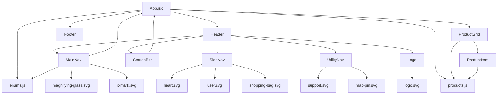

# Amen&Louay Fashion E-Commerce (React)

Une mini-application e-commerce moderne et responsive réalisée avec React, proposant un affichage dynamique des produits, des filtres combinables, une recherche instantanée et une interface épurée inspirée des boutiques de mode réelles.

---

## 🛠️ Stack Technique
- **React 19** (composants fonctionnels et hooks)
- **Vite** (développement et build ultra-rapides)
- **Tailwind CSS** (utilitaires CSS modernes)
- **ESLint** (qualité du code)
- **PostCSS** (traitement CSS)

---

## ✨ Fonctionnalités
- **Grille de produits responsive** avec images réelles et détails
- **Filtres dynamiques** par catégorie (Femme, Homme, Enfant), type (Vêtements, Chaussures, Accessoires), statut (Nouveau, Promo) et marque
- **Recherche instantanée** par nom de produit
- **Header et footer modernes** avec navigation, logo et liens utiles
- **Code propre et maintenable** avec séparation claire des responsabilités

---

## 📁 Structure du Projet
```
src/
  components/
    Footer.jsx         # Footer moderne avec logo et liens
    Header/
      Header.jsx       # Layout principal du header
      MainNav.jsx      # Navigation et filtres
      SearchBar.jsx    # Barre de recherche
      SideNav.jsx      # Icônes utilisateur, panier, favoris
    Logo.jsx           # Logo de la marque (utilise logo.svg)
    ProductGrid.jsx    # Grille de produits
    ProductItem.jsx    # Carte produit individuelle
    UtilityNav.jsx     # Liens support et magasins
  data/
    products.js        # Données produits (images, marques, etc.)
  utils/
    enums.js           # Enums catégorie/type
  assets/
    icons/             # Icônes SVG (logo, panier, user, etc.)
  App.jsx              # Logique principale et état global
  main.jsx             # Point d'entrée React
  index.css            # Styles de base Tailwind
```

---

## 🚀 Lancer le Projet
1. **Installer les dépendances :**
   ```bash
   npm install
   ```
2. **Démarrer le serveur de dev :**
   ```bash
   npm run dev
   ```
3. **Ouvrir dans le navigateur :**
   Rendez-vous sur [http://localhost:5173](http://localhost:5173)

---

## 🧩 Composants & Flux de Données



---

## 📚 Fonctionnalités détaillées
- **Filtres :**
  - Nav du haut : sélectionner/désélectionner une catégorie (Femme, Homme, Enfant)
  - Nav secondaire : sélectionner/désélectionner un type (Vêtements, Chaussures, Accessoires), un statut (Nouveau, Promo) et une marque
  - Tous les filtres sont combinables et la grille se met à jour instantanément
- **Recherche :**
  - La barre de recherche filtre les produits par nom en temps réel
- **Données produits :**
  - Tous les produits ont des images réalistes, des marques et des types variés
- **UI/UX :**
  - Design moderne, épuré et responsive
  - Branding cohérent avec logo et palette de couleurs

---

## 📝 Remarques
- Ce projet est une démo pédagogique et ne comprend pas de backend, d’authentification ou de paiement.
- Facilement extensible pour ajouter panier, authentification, etc.

---

## 👨‍💻 Auteur
- Réalisé par Amen&Louay pour stage et portfolio.
